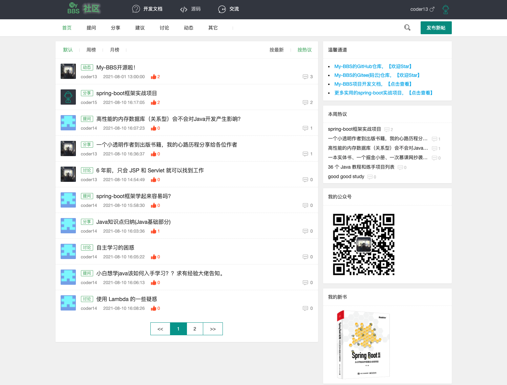
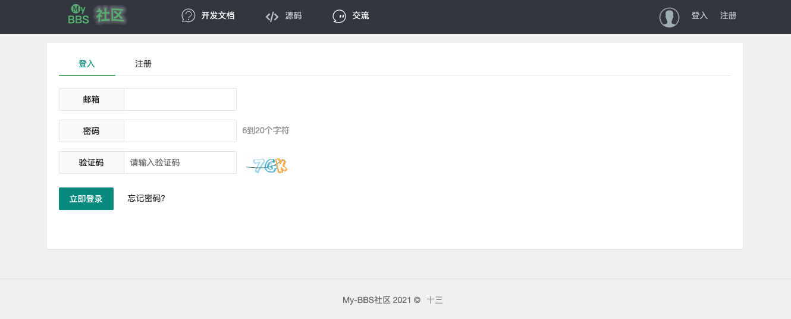
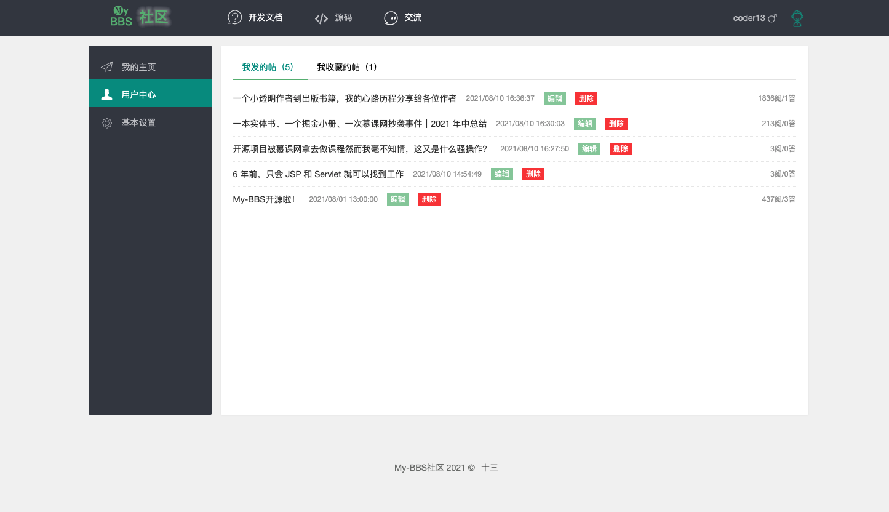
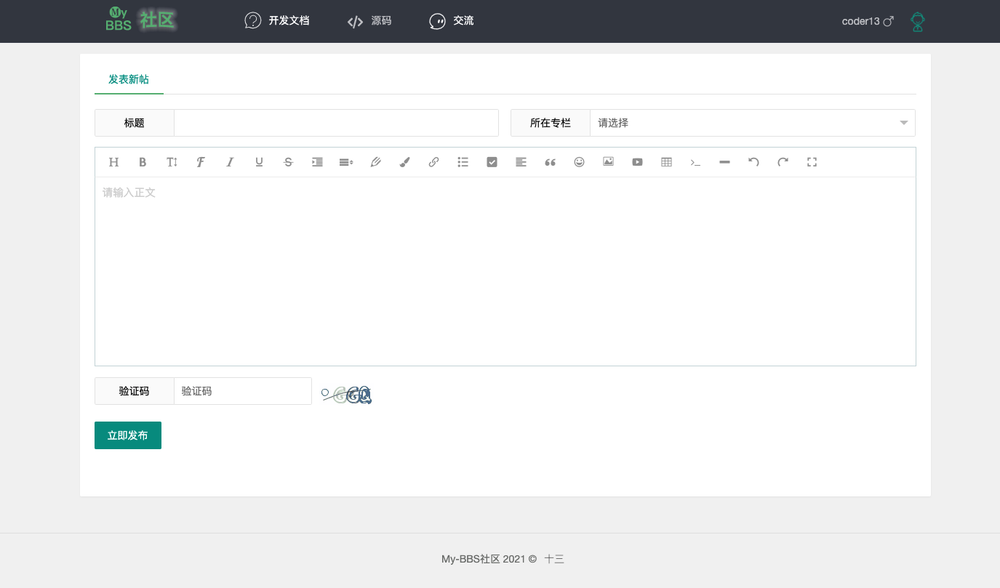
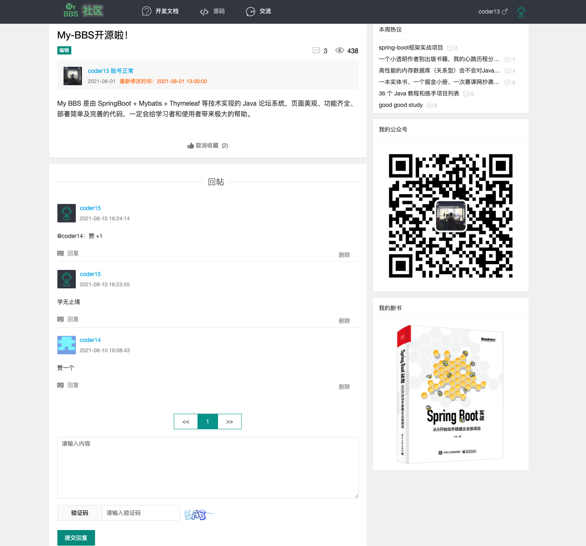

**坚持不易，各位朋友如果觉得项目还不错的话可以给项目一个 star 吧，也是对我一直更新代码的一种鼓励啦，谢谢各位的支持。**

My BBS 是由 SpringBoot + Mybatis + Thymeleaf 等技术实现的 Java 论坛系统，页面美观、功能齐全、部署简单及完善的代码，一定会给学习者和使用者带来极大的帮助。

当前分支的 Spring Boot 版本为 2.4.0，想要学习和使用其它版本可以直接点击下方的分支名称跳转至对应的仓库分支中。

| 分支名称                                                    | Spring Boot Version |
| ------------------------------------------------------------ | ------------------- |
| [spring-boot-3.x](https://github.com/ZHENFENG13/My-BBS/tree/spring-boot-3.x) | 3.1.0       |
| [main](https://github.com/ZHENFENG13/My-BBS)            | 2.4.0               |

- **一个以 Spring Boot 技术栈实现的 BBS 论坛实战项目；**
- **你也可以把它作为 Spring Boot 技术栈的学习项目，My BBS 足够符合要求，且代码和功能完备；**
- **技术栈新颖且知识点丰富，学习后可以提升大家对于知识的理解和掌握，对于提升你的市场竞争力有一定的帮助。**
- **My BBS 还有一些不完善的地方，鄙人才疏学浅，望见谅；**
- **有任何问题都可以反馈给我，我会尽量完善该项目。**

> 更多 Spring Boot 实战项目可以关注十三的另一个代码仓库 [spring-boot-projects](https://github.com/ZHENFENG13/spring-boot-projects)，该仓库中主要是 Spring Boot 的入门学习教程以及一些常用的 Spring Boot 实战项目教程，包括 Spring Boot 使用的各种示例代码，同时也包括一些实战项目的项目源码和效果展示，实战项目包括基本的 web 开发以及目前大家普遍使用的前后端分离实践项目等，后续会根据大家的反馈继续增加一些实战项目源码，摆脱各种 hello world 入门案例的束缚，真正的掌握 Spring Boot 开发。

## 开发文档

### 《SpringBoot + Mybatis + Thymeleaf 开发 BBS 论坛项目》(支付减免优惠券码 jRPuZHPz )

- [**第01课：Spring Boot 技术栈详解**](https://www.shiyanlou.com/courses/4830)
- [第02课：快速构建 Spring Boot 应用](https://www.shiyanlou.com/courses/4830)
- [第03课：Spring Boot 项目开发之Web项目开发讲解](https://www.shiyanlou.com/courses/4830)
- [第04课：Spring Boot 整合 Thymeleaf 模板引擎](https://www.shiyanlou.com/courses/4830)
- [第05课：Thymeleaf 语法详解](https://www.shiyanlou.com/courses/4830)
- [第06课：Spring Boot 自动配置数据源及操作数据库](https://www.shiyanlou.com/courses/4830)
- [第07课：Spring Boot 整合 MyBatis 操作数据库](https://www.shiyanlou.com/courses/4830)
- [第08课：分页功能的设计与实现](https://www.shiyanlou.com/courses/4830)
- [第09课：BBS论坛项目开发之验证码功能](https://www.shiyanlou.com/courses/4830)
- [第10课：BBS论坛项目开发之前端技术选型及源码目录详解](https://www.shiyanlou.com/courses/4830)
- [第11课：BBS论坛项目开发之用户注册模块实现](https://www.shiyanlou.com/courses/4830)
- [第12课：BBS论坛项目开发之用户登录模块实现](https://www.shiyanlou.com/courses/4830)
- [第13课：BBS论坛项目开发之用户登录拦截器](https://www.shiyanlou.com/courses/4830)
- [第14课：BBS论坛项目实战之处理文件上传及路径回显](https://www.shiyanlou.com/courses/4830)
- [第15课：BBS论坛项目实战之个人中心页面制作](https://www.shiyanlou.com/courses/4830)
- [第16课：富文本编辑器 wangEditor 整合](https://www.shiyanlou.com/courses/4830)
- [第17课：BBS论坛项目实战之论坛首页开发](https://www.shiyanlou.com/courses/4830)
- [第18课：BBS论坛项目实战之帖子发布功能开发](https://www.shiyanlou.com/courses/4830)
- [第19课：BBS论坛项目实战之帖子详情和修改功能开发](https://www.shiyanlou.com/courses/4830)
- [第20课：BBS论坛项目实战之评论功能开发](https://www.shiyanlou.com/courses/4830)

## 联系作者

> 大家有任何问题或者建议都可以在 [issues](https://github.com/ZHENFENG13/My-BBS/issues) 中反馈给我，我会慢慢完善这个项目。

- 我的邮箱：2449207463@qq.com
- QQ技术交流群：719099151 796794009

> My-BBS 在 GitHub 和国内的码云都创建了代码仓库，如果有人访问 GitHub 比较慢的话，建议在 Gitee 上查看该项目，两个仓库会保持同步更新。

- [My-BBS in GitHub](https://github.com/ZHENFENG13/My-BBS)
- [My-BBS in Gitee](https://gitee.com/zhenfeng13/My-BBS)

## 效果预览

- 首页

  

- 登录

  

- 用户中心

  
  
- 用户动态

  

- 发布帖子

  

- 帖子详情

  

## 感谢

- [spring-projects](https://github.com/spring-projects/spring-boot)
- [pandao](https://github.com/pandao/editor.md)
- [fly](https://github.com/layui/fly)
- [layui](https://www.layui.com/)

